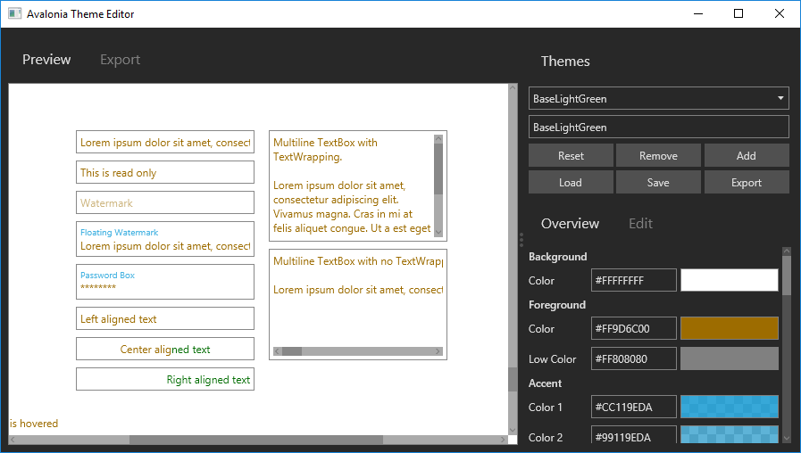

# Avalonia Theme Editor

 

## Download

| Platform              | Version    | Download                                                                                                                                     |
|-----------------------|------------|----------------------------------------------------------------------------------------------------------------------------------------------|
| win7-x64              | 0.8.0      | [ThemeEditor-win7-x64.zip](https://github.com/wieslawsoltes/ThemeEditor/releases/download/0.8.0/ThemeEditor-win7-x64.zip)                    |
| ubuntu.14.04-x64      | 0.8.0      | [ThemeEditor-ubuntu.14.04-x64.zip](https://github.com/wieslawsoltes/ThemeEditor/releases/download/0.8.0/ThemeEditor-ubuntu.14.04-x64.zip)    |
| debian.8-x64          | 0.8.0      | [ThemeEditor-debian.8-x64.zip](https://github.com/wieslawsoltes/ThemeEditor/releases/download/0.8.0/ThemeEditor-debian.8-x64.zip)            |
| osx.10.12-x64         | 0.8.0      | [ThemeEditor-osx.10.12-x64.zip](https://github.com/wieslawsoltes/ThemeEditor/releases/download/0.8.0/ThemeEditor-osx.10.12-x64.zip)          |

# About

ThemeEditor is an [Avalonia UI Framework](http://avaloniaui.net/) theme editor.

# Usage

[Usage instructions](https://github.com/wieslawsoltes/ThemeEditor/wiki/Usage).

# Build

[Build instructions](https://github.com/wieslawsoltes/ThemeEditor/wiki/Build).

# Resources

* [GitHub source code repository.](https://github.com/wieslawsoltes/ThemeEditor)
* [Wiki.](https://github.com/wieslawsoltes/ThemeEditor/wiki)

# License

ThemeEditor is licensed under the [MIT license](LICENSE.TXT).
